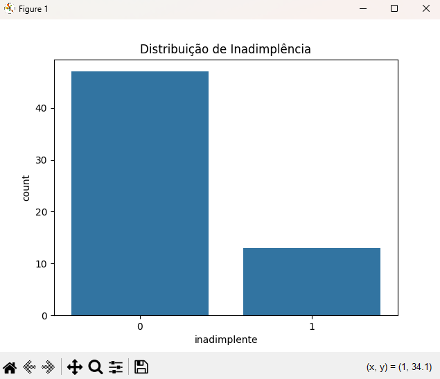
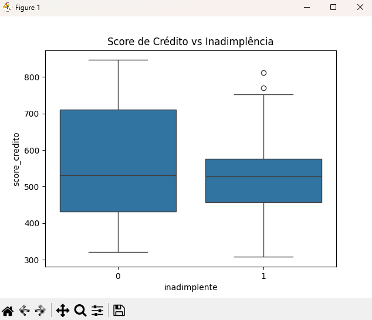

# 📊 Análise de Crédito com Aprendizagem Bayesiana

## 📌 Visão Geral
Este projeto tem como objetivo aplicar conceitos de Aprendizagem Bayesiana para análise de risco de crédito, utilizando dados sintéticos e estatística probabilística em Python.

O foco do projeto é demonstrar, de forma prática e didática, como a probabilidade condicional pode auxiliar na tomada de decisão em cenários reais, como a identificação de clientes com maior risco de inadimplência.

Este é um projeto de nível júnior, voltado para estudos iniciais em Ciência de Dados, Estatística e Machine Learning.

---

## 🧠 Conceito: Aprendizagem Bayesiana
A Aprendizagem Bayesiana é baseada no Teorema de Bayes, que permite atualizar probabilidades à medida que novas evidências são observadas.

De forma simplificada, o projeto responde à seguinte pergunta:

> Qual é a probabilidade de um cliente ser inadimplente dado que ele já atrasou um pagamento?

Essa abordagem é amplamente utilizada em:
- Análise de risco de crédito
- Sistemas de apoio à decisão
- Modelos probabilísticos

---

## 📁 Arquitetura do Projeto

```text
aprendizagem_bayesiana/
│
├── data/
│ ├── credito.csv # Base de dados sintética
│ └── gerar_dados.py # Script de geração dos dados
│
├── src/
│ ├── carregar_dados.py # Leitura da base de dados
│ ├── tratamento.py # Limpeza e tratamento dos dados
│ ├── analise_exploratoria.py # Análise exploratória e gráficos
│ └── bayes.py # Cálculo Bayesiano
│
├── img/ # Imagens geradas pelos gráficos
├── main.py # Arquivo principal do projeto
└── README.md
```

---

## 📄 Descrição dos Arquivos

### data/gerar_dados.py
Responsável por gerar uma base de dados sintética de crédito, contendo informações como idade, renda, score de crédito, atraso em pagamento e inadimplência.

O script também insere dados inconsistentes propositalmente, permitindo demonstrar técnicas de tratamento de dados.

---

### data/credito.csv
Base de dados utilizada no projeto.

Os dados simulam um cenário real de análise de crédito e são usados em todas as etapas de análise e modelagem.

---

### src/carregar_dados.py
Arquivo responsável pela leitura do arquivo CSV e carregamento dos dados em um DataFrame pandas.

---

### src/tratamento.py
Contém as funções de limpeza e tratamento dos dados, como:
- Correção de valores negativos
- Ajuste de idades irreais
- Correção de scores fora do intervalo válido

---

### src/analise_exploratoria.py
Responsável pela análise exploratória dos dados (EDA) e geração dos gráficos.

Essa etapa ajuda a entender padrões, distribuições e relações entre as variáveis do conjunto de dados.

---

## 📈 Análise Estatística Descritiva

Após o tratamento dos dados, foi realizada uma análise estatística descritiva para compreender o perfil dos clientes e o comportamento das variáveis envolvidas no estudo de inadimplência.

### Estatísticas Resumidas

| Métrica | Idade | Renda Mensal | Valor do Empréstimo | Score de Crédito | Atraso de Pagamento | Inadimplente |
|--------|------:|-------------:|--------------------:|-----------------:|-------------------:|-------------:|
| Count  | 60.00 | 60.00 | 60.00 | 60.00 | 60.00 | 60.00 |
| Mean   | 43.48 | 3641.70 | 15027.51 | 560.14 | 0.25 | 0.22 |
| Std    | 15.33 | 1195.69 | 6048.52 | 163.00 | 0.44 | 0.42 |
| Min    | 19.00 | 1600.05 | 843.80 | 308.00 | 0.00 | 0.00 |
| 25%    | 31.75 | 2857.58 | 11865.30 | 433.00 | 0.00 | 0.00 |
| 50%    | 42.00 | 3626.68 | 13767.91 | 528.25 | 0.00 | 0.00 |
| 75%    | 56.25 | 4466.47 | 18788.98 | 707.00 | 0.25 | 0.00 |
| Max    | 69.00 | 7546.76 | 32774.14 | 846.00 | 1.00 | 1.00 |

### 🔎 Origem das Estatísticas e Probabilidades

As estatísticas descritivas apresentadas nesta seção (count, mean, std, quartis e valores extremos) são geradas durante a etapa de **análise exploratória**, implementada no arquivo `src/analise_exploratoria.py`.

Esse módulo é responsável por calcular os resumos estatísticos a partir do DataFrame já tratado e por gerar os gráficos utilizados no projeto.

A **probabilidade de inadimplência dado atraso de pagamento** é calculada no arquivo `src/bayes.py`, utilizando conceitos de probabilidade condicional.

Todo esse fluxo é coordenado pelo arquivo `main.py`, que executa as etapas na seguinte ordem:
- carregamento dos dados  
- tratamento  
- análise exploratória  
- cálculo bayesiano

### Análise Bayesiana

A partir dos dados, foi calculada a **probabilidade de inadimplência dado que o cliente apresentou atraso de pagamento**:

**P(Inadimplente \| Atraso) = 26,67%**

Esse resultado indica que clientes com histórico de atraso possuem maior risco de inadimplência, reforçando a importância dessa variável no modelo.

---

### src/bayes.py
Implementa o cálculo da probabilidade condicional utilizando o Teorema de Bayes.

O resultado principal é a probabilidade de um cliente ser inadimplente dado que ele já atrasou um pagamento.

---

### main.py
Arquivo principal que orquestra a execução do projeto, realizando:
- Carregamento dos dados
- Tratamento
- Análise exploratória
- Cálculo Bayesiano

---

## 📊 Análise Exploratória — Interpretação dos Gráficos

### 📌 Distribuição de Inadimplência



Este gráfico mostra a quantidade de clientes inadimplentes e não inadimplentes.
Na variável inadimplente, os valores representam:

0 → cliente não inadimplente

1 → cliente inadimplente

É possível observar que a maioria dos clientes não é inadimplente, o que representa um cenário realista de dados de crédito e justifica o uso de análise probabilística.

---

### 📌 Score de Crédito vs Inadimplência



Este gráfico mostra a relação entre o score de crédito e a inadimplência.
No eixo horizontal, a variável inadimplente indica:

0 → cliente não inadimplente

1 → cliente inadimplente

Clientes inadimplentes tendem a apresentar scores mais baixos, porém há sobreposição entre os grupos, indicando que o score sozinho não é suficiente para determinar o risco.

As bolinhas fora da caixa azul representam outliers, indicando clientes com scores muito acima ou muito abaixo do padrão do grupo.
Esses casos mostram que existem exceções ao comportamento esperado, reforçando que o score de crédito, isoladamente, não determina a inadimplência.

---

### 📌 Renda Mensal vs Inadimplência


O gráfico evidencia a relação entre renda mensal e inadimplência.
No eixo horizontal, a variável inadimplente representa:

0 → cliente não inadimplente

1 → cliente inadimplente

Clientes inadimplentes tendem a ter renda um pouco menor, mas também existem clientes com renda mais alta que se tornam inadimplentes.

As bolinhas fora da caixa azul representam outliers, ou seja, clientes com renda muito acima ou abaixo do padrão do grupo.
Esses casos indicam comportamentos atípicos e reforçam que a inadimplência não depende apenas da renda, mas da combinação de múltiplos fatores.

Isso reforça a necessidade de uma análise baseada em probabilidade, e não em regras fixas.

---

## ▶️ Como Executar o Projeto

```bash
python data/gerar_dados.py
python main.py
```

---

## 🎯 Conclusão
Este projeto demonstra, de forma simples e objetiva, como a Aprendizagem Bayesiana pode ser aplicada em problemas reais de análise de crédito.

Ele serve como uma base sólida para evolução futura, como a implementação de Naive Bayes com scikit-learn ou modelos mais avançados de classificação.
